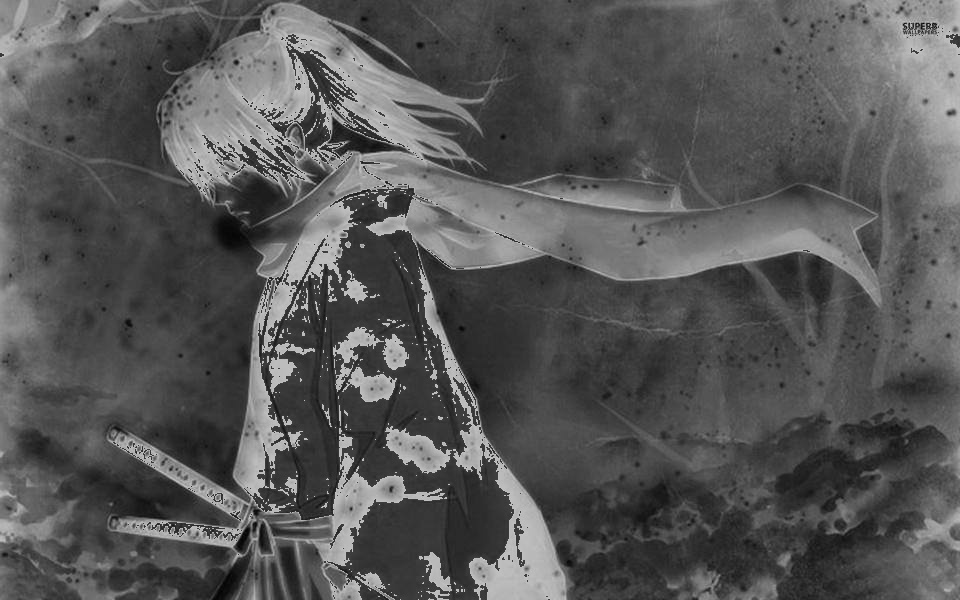
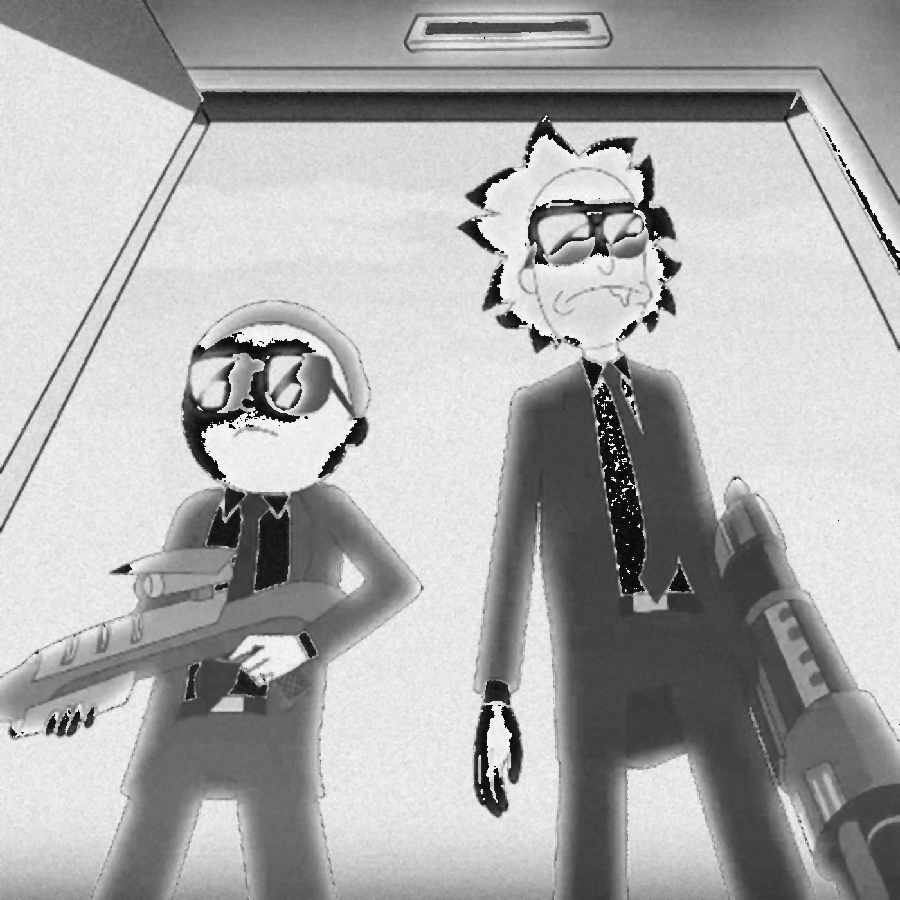

# Image-Processing

### First Exercise - Apply Noise and Filters
<!-- TODO write a brief summary -->
#### Tasks
- Apply **Pseudo-solarization** (Sabattier effect in photography).
- Apply **Salt&Pepper** and **Poisson Noise**
- Apply Filters for **Denoising**
<ol>
<li>Gaussian Blur</li>
<li>Median Blur</li>
<li>Bilateral Filter</li>
</ol>
- Shows scores **SSIM** and **MSE**

#### Pseudo-solarization

| Original | Sabattier  effect |
|:---:|:---:|
|        | 

#### Apply Noise       

| Salt and Pepper | Poisson Noise |
|:---:|:---:|
|        |        

#### Denoising with Median Filter

| Salt and Pepper | Poisson Noise |
|:---:|:---:|
|        | 

### Show scores
#### Salt & Pepper
| Filter | SSIM | MSE |
| :----: |:----:| :-: |
| Gaussian  | 0.3563 | 98.2824 |
| Median    | 0.9783 | 5.0062  |
| Bilateral | 0.3735 | 19.9881  |

#### Poisson
| Filter | SSIM | MSE |
| :----: |:----:| :-: |
| Gaussian  | 0.5520 | 116.8123 |
| Median    | 0.7572 | 116.7203  |
| Bilateral | 0.5238 | 111.0589  |

## Required Libraries
**OpenCV**  
**NumPy**  
**Scikit-Image**  
**random**  

# TODO SECOND LAB
